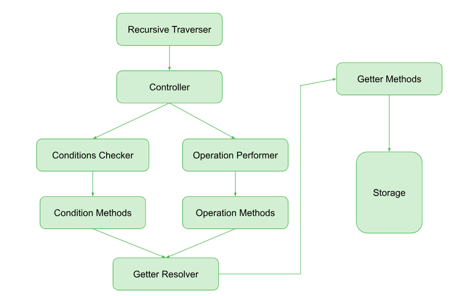

# **Json DSL**

## Working Explaination 




* **Recursive Traverser** :  As name suggest this method traverser from the json data according to the traverse method provided in the “Path” attribute in the rule 

* **Controller** : Controller is responsible for the checking of the condition and then call method for performing the operation on the part of the json at which condition get true

* **Operation Performer**  : This method is perform all the operation provided in the  rule on the target part of the json , it call the methods which are available in the “Operations methods” for performing the operations . 

* **Conditions Performer** : This method perform the conditions provided in the rule using the methods available  in the “Conditions methods”

* **Condition Methods** : This is the collection of the methods which have the return type of the boolean

* **Operation Methods** : This is the collection of the methods which have the return type of the json object which actually is the updated object 

* **Getters Methods** : After the condition method there is still need to one more collection of the methods which provide some other functionalities will be explain using the example in this Rough DOCS 😀
  
* **Getter Resolver** : This  method which resolves the getter method  if it is present in the json rules 

* **Storage** : In this DSL there is the functionality to creat variables which is get store in the same object and can be accessed by using the “getStorage” which is the one of the methods of the “Getters Methods” so that can be used in from any stage , currently i just made this feature for the “ValueIterator” which is one of the method of the Operation methods will be explain later.


## Syntax and Example


```js
 const transformRule = [
    {
        path: "*",
        condOperMapper: [
            {
                conditions: [{ "isKey": { key: "$schema" } }],
                operations: { "updateValue": { value: "https://json-schema.org/draft/2020-12/schema" } }

            }
        ]

    }
]
```

this is the one of example of the rule for DSL , in this <br>
* Rule must be the array in which each element represent the rule going to perform in that iteration process which represent by ```path``` , new element in the array represent the new condition and operations on json data which perform with fresh new iteration form the json data
* Path represent the the way we want to traverse from the JSON "*" represent the recursive there are more options which will explain later 
* condOperMapper , elements  which represent the condtion and operation specific operation only perform when condtions get true
* Overall it change the value of the kye "$schema" to the "https://json-schema.org/draft/2020-12/schema"


Now let see the one of the method which have littlbit  complex syntex compare to others 

```js
const transformRule = [
            {
                conditions: [{ "isKey": { key: "$ref" }, "valuePattern": ".*\\/items\\/.*" }],

                operations: {
                    "valueIterator": {
                        type: "string", splitBy: "/",
                        defineStorage: {
                            "prevReference": {
                                current: { getReference: { path: '/' } },
                                updater: [
                                    { conditions: [{ "isEqual": { value1: "#", value2: { getStorage: "_$value_" } } }], getters: { getReference: { path: "#" } } },
                                    { getters: { getReference: { path: { getConcatinate: ['/', { getStorage: "_$value_" }] }, from: { getStorage: "prevReference" } } } }
                                ]
                            },
                            "path": {
                                current: "",
                                updater: [
                                    {
                                        conditions: [{ "isEqual": { value1: "#", value2: { getStorage: "_$value_" } } }],
                                        getters: { getConcatinate: ['#'] }
                                    },
                                    {
                                        conditions: [
                                            {
                                                "isEqual": { value1: "items", value2: { getStorage: "_$value_" } },
                                                "hasSibling": { key: "type", value: "array", from: { getReference: { path: { getStorage: "path" } } } }
                                            }],
                                        getters: { getConcatinate: [{ getStorage: "path" }, '/', "prefixItems"] }
                                    },

                                    { getters: { getConcatinate: [{ getStorage: "path" }, '/', { getStorage: "_$value_" }] } }

                                ]
                            }
                        },

                        operations: {
                            "updateValue": { value: { getStorage: "path" } }
                        }


                    }
                }

            }
]
```


```valueIterator``` is the one of the method from  ```OperationsMethod``` it iterate from the value of the key which filter from the <br> ```conditions: [{ "isKey": { key: "$ref" }, "valuePattern": ".*\\/items\\/.*" }]``` <br> condtions will filter the element which have the key   ```$ref``` and its value follow the json schema pattern ```.*\\/items\\/.*```
<br> <br>
#### About Conditions Property : 
* Condtions is the array of the ```Condtion methods ```
* In condtions all the methods present in the same ```{ }``` somethign like this ```[{method1 , method2}]```will be performed as the *AND* operations between them means if single methods get return false no next conditions is going to check
* All the methods present in the difference `{ }`  something like this ```[{method1} , {method2}]``` then *OR* operations is going to perform between all the condtions means if single method return true no next condtions is going to be check

#### About Value Iterator : 
* It iterate from the value of type `string` , `array` and `object`
* For `splitBy` is the property which is used for th string which is used to split the string form the specific char , if not given then value is iterate from the all characters of the string
* For `array` and `object`it iterate from noramlly from the element
* Value Iterator maintain the variable  `_$value_` and `_$key_`  which represent the current value and key of the iteration which can be accessed using the `getStorage` method which is the one of the method of the `Getters methods`
* `defineStorage` is the one of the property of the Value Iterator which is used to define the *Varaibles* , in this *keys* are the name of the varaibels 
* `Current` is the property of the each of the defined variable which represent the current value of the define Storage
* `getReference` is the one of the methods of the `Getters method` which return the value of the key targeted using the `Path` attributed , '#' represent the root and '/' return the value of the current key for which this operation (value iterator is the type of the operation) is performed
* `updater` is the property which performed for every iteration to update the current value of the *variable*
* 
       


